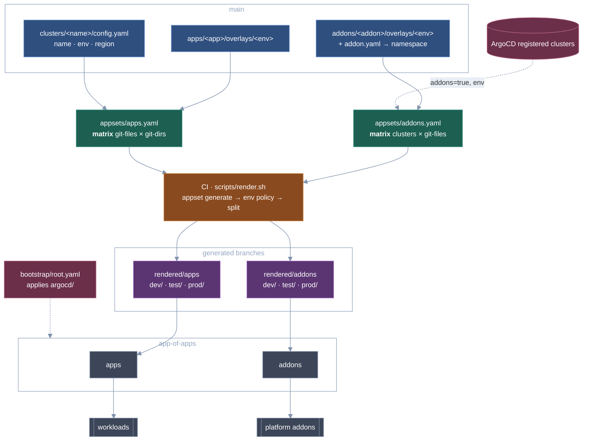

# rendered-appset-manifest

ApplicationSets are rendered in CI and the resulting ArgoCD `Application`s are
committed to per-track branches. Nothing generates Applications at runtime: the
cluster only ever syncs plain, reviewable YAML that a human can read in a diff.

## How it fits together



| Path | Branch | What lands there |
|---|---|---|
| `appsets/apps.yaml` | `rendered/apps` | `<env>/<app>-<cluster>.yaml` |
| `appsets/addons.yaml` | `rendered/addons` | `<env>/<addon>-<cluster>.yaml` |

Environments are **directories inside** each rendered branch, not branches of
their own. Git cannot hold a `rendered/apps` ref and a `rendered/apps/dev` ref at
the same time, since one would have to be both a file and a directory.

## The two ApplicationSets

### `appsets/apps.yaml`: matrix( git-files × git-directories )

```
git-files(clusters/*/config.yaml)  ->  cluster.name, cluster.env, cluster.region
        x
git-directories(apps/*/overlays/{{ .cluster.env }})  ->  the app overlay
```

The second generator's path is **interpolated from the first**. That is the whole
reason this is a matrix rather than two separate AppSets: each cluster fans out
only across the app overlays that exist for its own environment. An app opts out
of an environment by simply not having that overlay directory. `apps/app-b` has
no `overlays/prod`, so it is never paired with a prod cluster.

Cluster metadata lives in git, so onboarding a cluster is a new file under
`clusters/`; the AppSet itself never changes.

Applications are named `<app>-<cluster>`, not `<app>-<env>`. There are two prod
clusters, and `app-a-prod` would otherwise be generated twice.

### `appsets/addons.yaml`: matrix( clusters × git-files )

```
clusters(matchLabels: addons=true, env in [dev,test,prod])  ->  name, metadata.labels
        x
git-files(addons/*/overlays/{{ .metadata.labels.env }}/addon.yaml)  ->  addon.namespace
```

Generator 1 is the ArgoCD **cluster generator**: it enumerates clusters already
registered with ArgoCD rather than reading them from git. Labelling a cluster
secret is all it takes to give it the addon baseline, with no commit required.

Generator 2 is the git **files** generator rather than directories, because a
directory listing cannot tell you an addon's target namespace. `addon.yaml`
supplies it, which is how `kube-prometheus-stack` lands in `monitoring` and
`cert-manager` in `cert-manager`.

### Cluster destinations

Every generated Application targets its cluster by name, never by API server
URL:

```yaml
destination:
  name: prod-eu-west      # must match the cluster's name in ArgoCD
  namespace: app-a
```

The apps track takes that from `cluster.name` in the cluster config; the addon
track takes it from the cluster generator's `.name`, which is the registered
name (`.nameNormalized` is the DNS-safe form, right for the Application's own
name but not for a destination). The hand-written app-of-apps and
`bootstrap/root.yaml` target `in-cluster` the same way.

This keeps one identifier per cluster instead of a name and a URL that have to
agree, and it means re-registering a cluster behind a new endpoint does not
touch this repository.

### Where environment policy lives

Both AppSet templates are uniform: every generated Application gets
`automated: {prune: true, selfHeal: true}`. Nothing in the templates branches on
environment, and neither AppSet uses `templatePatch`.

Environment policy is applied **at render time** instead, by a table near the top
of `scripts/render.sh` keyed on `<track>/<env>`:

| rule | effect |
|---|---|
| `apps/prod` | `del(.spec.syncPolicy.automated)`, so prod workloads sync by hand |
| `addons/prod` | `.spec.syncPolicy.automated.prune = false`, so prod addons are never auto-deleted |

Anything not listed renders exactly as generated. This works precisely because
the manifests are committed: the effect of every rule shows up in the diff on the
rendered branch, and each affected file carries a `# policy:` line saying which
rule touched it. Keeping it here rather than in the AppSets means the AppSets stay
free of conditionals. The reason to check `render.sh` is that it is the one file
that decides what differs between environments.

There is one app-of-apps per track, each recursing its whole branch, and both
are automated. The prod gate lives on the Application itself: `render.sh` strips
the automated block from every `apps/prod` Application, so a newly rendered prod
workload appears on its own and then sits `OutOfSync` waiting for a human.
Gating at the app-of-apps level as well would mean two syncs to ship one change.

Pruning at the app-of-apps level only governs whether an Application object that
stopped generating is deleted. The generated Applications carry no finalizer, so
that never cascades into running workloads.

## Rendering

`scripts/render.sh <appset> <outdir>` generates one AppSet server-side, applies
the environment policy table above, and splits the output into
`<outdir>/<env>/<name>.yaml`, one Application per file.

Routing comes from two labels every template stamps, and the policy table is
keyed on the same pair:

```yaml
gitops.34fathombelow.io/track: apps      # which branch
gitops.34fathombelow.io/env: dev         # which directory
```

A third label, `gitops.34fathombelow.io/cluster`, is stamped for selecting and
grepping Applications later. `render.sh` does not read it.

The script refuses to write anything unless the whole set renders cleanly. It
builds into a staging directory and swaps it into place, and it fails loudly on:

- zero Applications generated (a cluster generator returns nothing when no cluster
  carries the labels, and silently publishing that would delete every Application)
- an Application with no `env` label, or an `env` outside `dev|test|prod`
- two generator combinations rendering the same Application name

Keys are sorted and `metadata.namespace` is pinned to `argocd`, so a no-op render
produces no commit.

```bash
export ARGOCD_SERVER=argocd.example.com
export ARGOCD_AUTH_TOKEN=...
./scripts/render.sh appsets/apps.yaml   /tmp/rendered-apps
./scripts/render.sh appsets/addons.yaml /tmp/rendered-addons
```

## Previewing a change

`scripts/preview.sh` renders a revision and diffs the result against what is
currently on the rendered branches, which is the preview CI cannot give you.

```bash
scripts/preview.sh              # current branch, both tracks
scripts/preview.sh -r main      # a specific revision
scripts/preview.sh -t addons    # one track
```

It reports each Application as added, removed or modified, then shows the
line-level diff:

```
--- rendered/apps ---
    ~ dev/app-a-dev-us-east.yaml
    + dev/app-c-dev-us-east.yaml
    - test/app-b-test-us-east.yaml

==> 1 added, 1 removed, 1 changed
```

Two things about this are easy to get wrong, and the script handles both.

The generators in `appsets/` are pinned to `revision: main`. Rendering a feature
branch without overriding that reads main's `clusters/` and `apps/`, so a newly
added cluster produces no diff at all. The script rewrites the generator
revision, and only that: `targetRevision` on the template stays `main`, because
that is what the Applications will point at once merged.

Generation is server-side, so ArgoCD fetches the revision from the remote and
cannot see your working tree. The script refuses to run when the revision is not
on the remote, and warns when your local branch is ahead of it or you have
uncommitted changes.

Credentials are optional. With `ARGOCD_SERVER` and `ARGOCD_AUTH_TOKEN` unset,
`render.sh` falls back to the session from `argocd login`.

## CI

Everything lives in **`.github/workflows/ci.yaml`** as two jobs.

`validate` runs on every pull request and on pushes to `main`. It is entirely
offline, which matters because rendering needs an ArgoCD token and a fork PR
must never see one: `scripts/validate.sh` plus shellcheck, no network, no
cluster.

`render` has `needs: [validate]`, so nothing is published until that passes. It
is skipped entirely on pull requests. A job matrix renders both
tracks in parallel (`fail-fast: false`, so a broken addon render does not block
the app push) and publishes each to its orphan branch through a `git worktree`,
replacing the tree wholesale. `workflow_dispatch` takes a `track` input of
`all`, `apps` or `addons`.

Only the `render` job is granted `contents: write`, and only to push the
generated branches; the workflow default is read-only.

There is deliberately no kustomize or helm in CI. This pipeline renders ArgoCD
Applications, not the workloads they point at, so building every overlay meant
installing two extra tools and re-pulling the same Helm charts on every run
(measured at 17 seconds against 0.2 for the chart-free app overlays), and it
made publishing depend on upstream chart repositories being reachable. The
trade is that a broken overlay is not caught before it is published.

The rendered output is pushed directly rather than opened as a PR, unlike
`kargo-helm-prom-stack`, which raises a PR against its own `main`. The branches
here are machine-owned; protect them and review `main` instead.

`scripts/validate.sh` catches what this layout is actually prone to:

- a cluster config missing a field the template dereferences (`missingkey=error`
  turns that into a render failure)
- an overlay directory named after an environment that does not exist
- an `addon.yaml` whose `addon.name` disagrees with its directory
- two generator combinations that would collide on one Application name
- an app-of-apps pointing at the wrong branch, or missing `directory.recurse`,
  which would silently adopt nothing

## Repository layout

```
.github/workflows/
  ci.yaml                      validate, then render
appsets/
  apps.yaml                    matrix: git-files x git-directories
  addons.yaml                  matrix: clusters x git-files
clusters/
  <cluster>/config.yaml        cluster metadata, read by the files generator
apps/
  <app>/base/                  shared manifests
  <app>/overlays/<env>/        per-env kustomization; absence = opt out
addons/
  <addon>/base/                shared non-chart resources
  <addon>/overlays/<env>/      helmCharts + values.yaml + addon.yaml
argocd/
  projects/{apps,addons}.yaml  AppProjects, each with an appset-generate role
  app-of-apps/{apps,addons}.yaml   one per track, recursing its branch
bootstrap/root.yaml            apply once; syncs argocd/ from main
scripts/
  render.sh                    generate, apply env policy, split one file per app
  preview.sh                   render a revision and diff it against the branches
  validate.sh                  offline checks, no ArgoCD needed
  set-repo.sh                  rewrite the repo URL after forking
```

## Setup

1. **Rewrite the repo URL**

   ```bash
   ./scripts/set-repo.sh https://github.com/your-org/your-repo.git
   ```

2. **Describe your clusters** in `clusters/<name>/config.yaml`. `cluster.name`
   must match both the directory and the cluster's name as registered in
   ArgoCD. Generated Applications use a name-based destination, so there is no
   server URL to keep in step.

3. **Allow kustomize to inflate Helm charts.** Every addon overlay uses
   kustomize's `helmCharts:` field, which kustomize refuses to process without
   `--enable-helm`. ArgoCD's repo-server does not pass that flag by default, so
   without this the addon Applications sync-fail with `must specify --enable-helm`:

   ```bash
   kubectl -n argocd patch cm argocd-cm --type merge \
     -p '{"data":{"kustomize.buildOptions":"--enable-helm"}}'
   kubectl -n argocd rollout restart deploy/argocd-repo-server
   ```

   The apps track does not need this; only the addon overlays inflate charts.

4. **Label the cluster secrets** so the addon track's cluster generator sees them:

   ```bash
   kubectl -n argocd label secret <cluster-secret> addons=true env=dev
   ```

   A cluster without `addons=true` gets no addons. A cluster whose `env` is not
   `dev|test|prod` is rejected by the generator's `matchExpressions` rather than
   rendering into an unexpected directory.

5. **Create an ArgoCD account and token.** The token needs the
   `appset-generate` role from `argocd/projects/`. Note that the addon track's
   cluster generator has to enumerate every registered cluster, so its policy
   cannot be narrowed to one project:

   ```
   p, proj:addons:appset-generate, clusters, get, '*', allow
   ```

   If your ArgoCD instance restricts project roles from reading clusters, use a
   local account with an equivalent policy in `argocd-rbac-cm` instead.

6. **Add repository secrets**

   | Secret | Value |
   |---|---|
   | `ARGOCD_SERVER` | ArgoCD server hostname, no scheme |
   | `ARGOCD_AUTH_TOKEN` | token for the `appset-generate` account |

7. **Push `main`, then render.** The workflow creates both orphan branches on its
   first run:

   ```bash
   gh workflow run ci.yaml -f track=all
   ```

8. **Bootstrap the cluster once**

   ```bash
   kubectl apply -f bootstrap/root.yaml
   ```

   `root` syncs `argocd/` from `main`, which installs the two AppProjects and
   the two app-of-apps; each of those adopts its whole rendered branch.

## Adding things

**A new app.** Add `apps/<app>/base/` plus an overlay per environment it belongs in.
Omit an overlay to skip that environment. No AppSet change.

**A new addon.** Add `addons/<addon>/base/` plus `overlays/<env>/` containing
`kustomization.yaml`, `values.yaml` and `addon.yaml`. Stage it dev-only by
creating just `overlays/dev/`. No AppSet change.

**A new cluster.** Add a file under `clusters/` for the apps track, and
`addons=true env=<env>` labels on its ArgoCD secret for the addon track. No AppSet
change.

**A new environment.** Add it to `VALID_ENVS` in both `scripts/render.sh` and
`scripts/validate.sh`, to the `matchExpressions` in `appsets/addons.yaml`, and add
nothing else. The app-of-apps recurse their whole branch, so a new `<env>`
directory is adopted without any change under `argocd/`. If the environment
needs its own sync policy, add a case to `policy_for`/`policy_note` in
`scripts/render.sh`; otherwise it inherits the uniform automated sync from the
AppSet template.

## The generated branches

`rendered/apps` and `rendered/addons` are machine-owned orphan branches. Every
file carries a generated-by header, the tree is replaced wholesale on each run,
and a branch README says the same. Do not edit them or open PRs against them.
Change `main` and let CI republish.

## Limitations

Things this pattern gives up, worth weighing before adopting it.

**Nothing validates the workloads.** CI checks the repository layout and
renders Applications; it never builds the kustomize overlays those Applications
point at. A malformed `kustomization.yaml`, a chart version that does not exist,
or a values file the chart rejects all render into a perfectly valid Application
and fail at sync time instead. `scripts/preview.sh` will not catch it either,
since it diffs Applications rather than workloads. Run `kustomize build
--enable-helm` locally on an overlay you have changed.

**Rendering needs a reachable ArgoCD.** `argocd appset generate` runs
server-side, so there is no offline render and CI cannot produce one without a
live server and a token. A fork PR must never see that token, so the pull
request itself can never show the Application diff it will produce.
`scripts/preview.sh` closes most of this gap for anyone who can reach ArgoCD,
but it is run by hand rather than enforced, and a contributor without cluster
access still cannot see what their change renders to.

**The addon track is not reproducible from git alone.** Its cluster generator
reads whatever clusters happen to be registered and labelled in ArgoCD at render
time. The same commit can render differently next week because somebody labelled
a cluster. For that track the repository is no longer the whole input, which is
the price of not having to commit a file per cluster.

**Nothing reconciles `main` against the rendered branches.** If a render fails,
or somebody pushes to a rendered branch directly, the cluster keeps running
whatever is on the branch and no check reports the divergence. The next
successful render silently corrects it, because the tree is replaced wholesale.

**Changes are not atomic across tracks.** An app and the addon it depends on
live on different branches, rendered by different jobs and adopted by different
app-of-apps. There is no way to land both in one step, and no ordering guarantee
between them.

**Two hops of latency.** A commit to `main` is live only once CI has rendered
and the relevant app-of-apps has synced. For prod apps there is a third hop,
since those render without automated sync on purpose.

**You give up the ApplicationSet controller.** The AppSets are never applied to
a cluster, so anything that lives in the controller is unavailable. Most
notably `strategy: RollingSync` for progressive rollouts across generated
Applications, and the controller's own correction of drift on the Applications
it owns.

**Environment policy lives in bash.** The `policy_for` table in
`scripts/render.sh` is not declarative configuration and is invisible from the
AppSets. It is auditable only through its committed output, which is the reason
each affected file carries a `# policy:` line.
