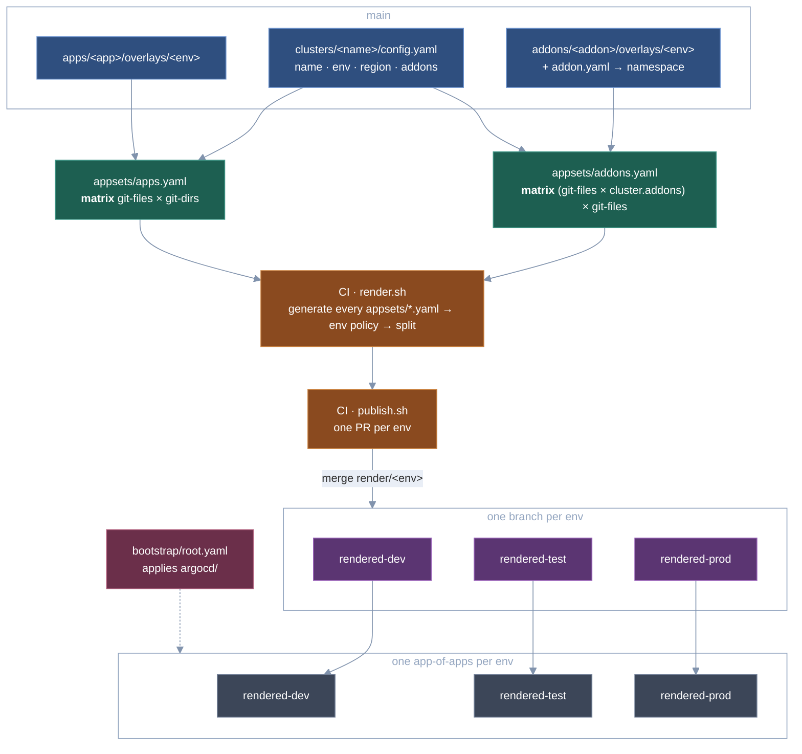

# rendered-appset-manifest

ApplicationSets are rendered in CI, and the resulting ArgoCD `Application`s reach
the cluster through **one pull request per environment**, whatever AppSet they
came from. Nothing generates Applications at runtime: the cluster only syncs plain
YAML that was reviewed in a diff, and merging an environment's PR is what deploys
to it.

Only the Application objects are rendered. Each one points back at an overlay on
`main`, and ArgoCD builds the workload itself (kustomize/Helm) at sync time.

## How it fits together



Each environment has its own branch holding only that env's Applications, from
every AppSet, one per file at the branch root:

```
rendered-dev    app-a-dev-us-east.yaml  cert-manager-dev-us-east.yaml  ...
rendered-test   app-a-test-us-east.yaml ...
rendered-prod   app-a-prod-us-east.yaml ...
```

| AppSet | Files it produces |
|---|---|
| `appsets/apps.yaml` | `<app>-<cluster>.yaml` (project `apps`) |
| `appsets/addons.yaml` | `<addon>-<cluster>.yaml` (project `addons`) |

Separate branches give each env its own history (`git log rendered-prod` is
prod's deploy log) and **its own branch protection**: protect `rendered-prod`
with more required approvals than `rendered-dev`. Each branch is adopted by its
own app-of-apps (`argocd/app-of-apps/<env>.yaml`), so a sync or prune on one env
can never touch another.

Application names must be unique across **all** AppSets and envs, since they
all live in argocd's namespace; `render.sh` fails on a duplicate.

## Clusters

`clusters/<name>/config.yaml` is the **only** cluster inventory. Both AppSets read it:

```yaml
cluster:
  name: prod-us-east   # must match the directory AND the cluster's name in ArgoCD
  env: prod            # dev | test | prod
  region: us-east-1
  addons:              # opt-in, by directory name under addons/; [] for none
    - cert-manager
    - kube-prometheus-stack
```

Every generated Application targets its cluster by name (`destination.name`),
never by server URL, so re-registering a cluster behind a new endpoint does not
touch this repo. Every cluster gets every app that has an overlay for its env,
but **only the addons it lists**.

## The ApplicationSets

Both current AppSets are a matrix whose second generator's path is **interpolated from the
cluster's env**, so each cluster only fans out across overlays that exist for its
environment. An app or addon opts out of an environment by not having that
overlay directory (`apps/app-b` has no `overlays/prod`).

```
apps:    git-files(clusters/*/config.yaml) x git-directories(apps/*/overlays/{{ .cluster.env }})
addons:  ( git-files(clusters/*/config.yaml) x list(cluster.addons) )
           x git-files(addons/{{ .enabledAddon }}/overlays/{{ .cluster.env }}/addon.yaml)
```

The addons AppSet nests a matrix so that `cluster.addons` expands into one
(cluster, addon) pair per enabled addon; a `selector` cannot compare a parameter
against a list. It uses the files generator because `addon.yaml` supplies the
target namespace, which a directory listing cannot.

`validate.sh` fails if a cluster lacks `cluster.addons` (with `missingkey=error`
that would break the whole render) or enables an addon that doesn't exist or has
no overlay for the cluster's env (the generator would silently skip it).

**`pathParamPrefix` is required.** Both generators in each matrix emit a `path`
parameter, and the *first* one wins, so without a prefix `.path` would be the
cluster directory and every app on a cluster would collapse onto one name. The
second generator sets `pathParamPrefix` (`app` for apps, `overlay` for addons),
so the overlay is `.app.path` / `.overlay.path`.

Applications are named `<app>-<cluster>`, not `<app>-<env>`, because there are
two prod clusters.

## Environment policy

Both templates are uniform (`automated: {prune: true, selfHeal: true}`).
Environment differences are applied **at render time** by one yq expression at
the top of `scripts/render.sh`, keyed on each Application's
`gitops.34fathombelow.io/track` and `.../env` labels:

| rule | effect |
|---|---|
| `apps/prod` | automated sync removed, so prod workloads sync by hand |
| `addons/prod` | `prune: false`, so prod addons are never auto-deleted |

Each affected file carries a `# policy:` header line, and the effect of every
rule is visible in the environment's PR.

## CI

`.github/workflows/ci.yaml` has two jobs.

**`validate`** runs on every PR and push to `main`: `scripts/validate.sh` plus
shellcheck, fully offline, so fork PRs never see the ArgoCD token.

**`render`** runs on pushes to `main` (never on PRs):

1. `scripts/render.sh` runs `argocd appset generate` on **every** file in
   `appsets/`, applies the env policy, and splits the combined result into
   `<env>/<name>.yaml`, one directory per env branch. It fails before writing anything if an AppSet generates
   zero Applications, an Application has a missing or unknown `env` label, or two
   Applications (from any AppSets) share a name.
2. `scripts/publish.sh` opens or updates one PR per environment, from
   `render/<env>` into `rendered-<env>`: at most three PRs per push, however
   many AppSets there are.

Each env PR targets its own branch, so they never conflict and can be merged
independently: dev today, prod next week. An app and the addon it
needs land in the same PR. Every push to `main` rebuilds the open PRs from the
latest render; an env with nothing to change has its PR closed. Merging is the
deploy.

There is deliberately no kustomize or helm in CI: it renders Applications, not
the workloads they point at, so a broken overlay is caught at sync, not here.

## Local use

With `ARGOCD_SERVER`/`ARGOCD_AUTH_TOKEN` unset, scripts fall back to your
`argocd login` session.

```bash
scripts/validate.sh                          # offline checks
scripts/render.sh /tmp/r                     # render every AppSet
scripts/render.sh /tmp/r appsets/apps.yaml   # or just some
DRY_RUN=1 scripts/publish.sh /tmp/r          # per-env diff, pushes nothing
kubectl apply --dry-run=server -n argocd -f /tmp/r/dev/
```

Generation is server-side: the generators read `clusters/`, `apps/` and
`addons/` from `main` on the remote, not your working tree. Template edits in
`appsets/` are picked up locally; changes to those directories need a push.
To render a specific pushed commit or branch instead of `main`, set
`RENDER_REVISION=<sha-or-branch>`. CI always sets it to the pushed SHA, because
ArgoCD caches what `main` resolves to and a render right after a push can
otherwise read the previous commit.

## Setup

1. **Point the repo URL at your fork:**
   `grep -rl 34fathombelow/rendered-appset-manifest --exclude-dir=.git . | xargs sed -i.bak 's|https://github.com/34fathombelow/rendered-appset-manifest.git|<your-url>|g' && find . -name '*.bak' -delete`
2. **Describe your clusters**: steps 1–3 of [Onboarding a cluster](#onboarding-a-cluster).
3. **Let kustomize inflate Helm charts** (the addon overlays use `helmCharts:`):
   ```bash
   kubectl -n argocd patch cm argocd-cm --type merge \
     -p '{"data":{"kustomize.buildOptions":"--enable-helm"}}'
   kubectl -n argocd rollout restart deploy/argocd-repo-server
   ```
4. **Create an ArgoCD token** that holds the `appset-generate` role of **every**
   project in `argocd/projects/` (one token renders all AppSets), and add repo
   secrets `ARGOCD_SERVER` (hostname, no scheme) and `ARGOCD_AUTH_TOKEN`.
5. **Allow Actions to open PRs:** Settings → Actions → General → *Allow GitHub
   Actions to create and approve pull requests*.
6. **Push `main`**, or `gh workflow run ci.yaml`. The first run creates empty
   `rendered-dev`, `rendered-test` and `rendered-prod` branches and opens one PR
   per env adding everything; merge them.
7. **Protect the env branches** (Settings → Branches): require a PR on each
   `rendered-*`, with as many approvals as each env warrants.
8. **Bootstrap once:** `kubectl apply -f bootstrap/root.yaml`. `root` syncs
   `argocd/` from `main`: the AppProjects and one app-of-apps per env.

## Onboarding a cluster

1. **Register it with ArgoCD** under the name you will use in git:

   ```bash
   argocd cluster add <kube-context> --name prod-ap-south
   argocd cluster list          # NAME column must match exactly
   ```

   Nothing in CI can check this. A name that ArgoCD doesn't know renders fine
   and then fails at sync with an unknown destination.

2. **Add `clusters/<name>/config.yaml`.** The directory name and `cluster.name`
   must match:

   ```yaml
   # Consumed by the git *files* generator in appsets/apps.yaml and appsets/addons.yaml.
   cluster:
     name: prod-ap-south
     env: prod                  # dev | test | prod
     region: ap-south-1
     addons:                    # [] for none
       - cert-manager
       - kube-prometheus-stack
   ```

3. **Check it offline:** `scripts/validate.sh`. It catches a name/directory
   mismatch, an unknown env, a missing `addons` key, and an addon that doesn't
   exist or has no overlay for this env.

4. **Open a PR to `main`, merge it.** CI renders and updates the PR for that
   env (`render/prod`). It lists one new file per app and per addon the cluster
   will get. Review it there.

5. **Merge the env PR.** Dev and test Applications sync on their own. **Prod
   apps don't**: sync them by hand once you're ready:

   ```bash
   argocd app sync -l gitops.34fathombelow.io/cluster=prod-ap-south
   ```

6. **Verify:**

   ```bash
   argocd app list -l gitops.34fathombelow.io/cluster=prod-ap-south
   ```

## Onboarding an app

1. **Create the base** under `apps/<app>/base/`: the manifests every env shares,
   plus a `kustomization.yaml`. Copy `apps/app-a/base/` as a starting point.

   The directory name is the app's identity: it becomes the Application name
   (`<app>-<cluster>`) **and the namespace it deploys into**, so it must be a
   valid DNS label (lowercase, digits, `-`). The namespace is created for you.

2. **Add one overlay per environment it should run in**, at
   `apps/<app>/overlays/<env>/kustomization.yaml`:

   ```yaml
   apiVersion: kustomize.config.k8s.io/v1beta1
   kind: Kustomization
   resources:
     - ../../base
   replicas:
     - name: my-app
       count: 2
   ```

   An env with no overlay doesn't get the app, so you can roll out by adding
   `overlays/dev/` first and `test`/`prod` in later PRs. Every cluster in an env
   that has an overlay gets the app; there is no per-cluster opt-in for apps.

3. **Check it:**

   ```bash
   scripts/validate.sh
   kustomize build apps/<app>/overlays/dev     # CI never builds overlays
   ```

   Keep to namespaced resources: the `apps` project allows no cluster-scoped
   kinds other than `Namespace`. Anything cluster-wide (CRDs, ClusterRoles)
   belongs in an addon.

4. **Open a PR to `main`, merge it**, then review and merge the `render/<env>`
   PR for each env you added an overlay for. Prod needs a manual
   `argocd app sync` after merging, as above.

## Adding an ApplicationSet

1. **Add `appsets/<name>.yaml`.** CI renders every file in `appsets/`, so there
   is no workflow, branch or app-of-apps change. The template must:
   - stamp `gitops.34fathombelow.io/env: <dev|test|prod>` on every Application
     (`validate.sh` checks the template has it; `render.sh` routes on it),
   - stamp `gitops.34fathombelow.io/track: <name>` so render policy can target it,
   - produce names that can't collide with other AppSets' (e.g. include the
     cluster name, as `<app>-<cluster>` does).
   Read clusters from `clusters/*/config.yaml` like the existing AppSets, and
   set `pathParamPrefix` on any second generator that also emits `path`.
2. **Pick a project.** Reuse `apps` or `addons` if the permissions fit, or add
   `argocd/projects/<name>.yaml` with its own `appset-generate` role, and add
   that role to the CI token.
3. **Optional env policy:** add a rule for its track to `TRANSFORM` in
   `scripts/render.sh`. Without one it renders exactly as generated.
4. **Merge to `main`** and review its Applications in the env PRs.

## Other changes

- **Addon:** `addons/<addon>/base/` plus `overlays/<env>/` with
  `kustomization.yaml`, `values.yaml` and `addon.yaml`, then list it in
  `cluster.addons` on each cluster that should get it.
- **Addon on one more cluster:** add it to that cluster's `cluster.addons`.
- **Environment:** add it to `VALID_ENVS` in `render.sh`, `publish.sh` and
  `validate.sh`, and add `argocd/app-of-apps/<env>.yaml` pointing at
  `rendered-<env>` (copy an existing one). The first render creates the branch.

None of these, nor onboarding a cluster or app, touch an AppSet.

### Removing things deletes workloads

Taking an app, addon or cluster out of git removes its Application from the next
env PR, and **merging that PR deletes the running resources**, in prod too.
`appset generate` puts `resources-finalizer.argocd.argoproj.io` on every
Application, so when the app-of-apps prunes one, ArgoCD cascades the delete to
everything it deployed. The `addons/prod` no-prune rule does not help here: it
covers resources inside an Application, not deleting the Application itself.
Read the `deleted` rows in an env PR as "this will be torn down".

## Layout

```
.github/workflows/ci.yaml      validate, then render + per-env PRs
appsets/*.yaml                 the ApplicationSets (never applied to a cluster)
clusters/<name>/config.yaml    cluster inventory, read by the AppSets
apps/<app>/{base,overlays/<env>}
addons/<addon>/{base,overlays/<env>}
argocd/projects/               AppProjects, each with an appset-generate role
argocd/app-of-apps/<env>.yaml  one per env, adopting rendered-<env>
bootstrap/root.yaml            apply once; syncs argocd/ from main
scripts/validate.sh            offline checks
scripts/render.sh              generate all AppSets, apply env policy, split per Application
scripts/publish.sh             one PR per env against rendered-<env>
```

## Limitations

- **Workloads aren't validated.** A malformed overlay or a missing chart version
  renders into a valid Application and fails at sync. Run
  `kustomize build --enable-helm` on overlays you change.
- **Rendering needs a reachable ArgoCD**, so a PR to `main` can't show its
  rendered diff; you see it in the env PRs after merging to `main`.
- **No ordering inside an env PR.** An app and the addon it needs merge
  together, but ArgoCD syncs them in parallel; an app needing an addon's CRDs
  may fail its first sync until the addon is up.
- **No ApplicationSet controller.** Controller features such as
  `strategy: RollingSync` are unavailable; the per-env PRs are the rollout
  mechanism instead.
